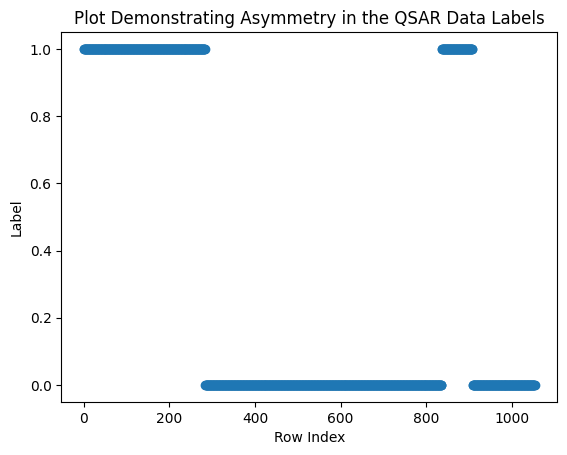
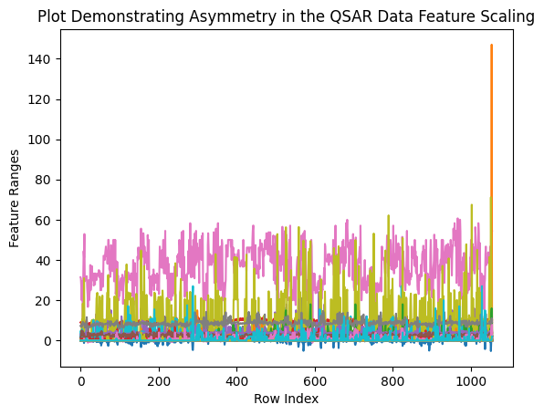
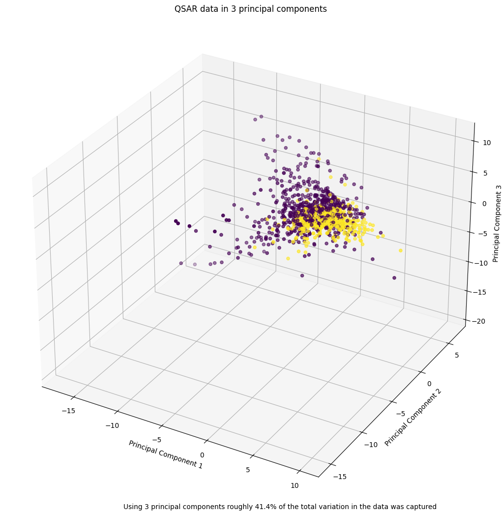
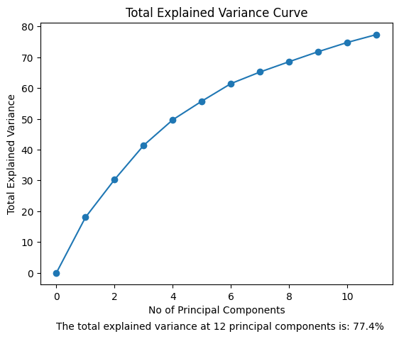
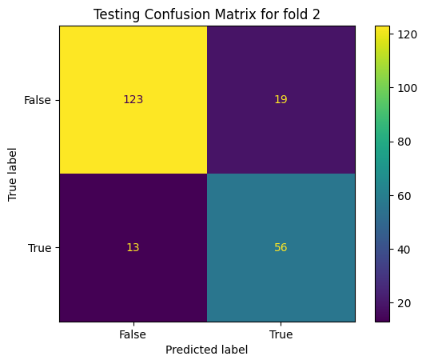

# QSAR Analysis using Machine Learning

This repository contains a QSAR (Quantitative Structure-Activity Relationship) modelling project that uses a Single Layer Perceptron (SLP) neural network to predict the biodegradability of chemical compounds based on their structural features.

## Overview

QSAR models predict the biological activity of chemical compounds based on their structural properties. This project implements a modern machine learning approach using a Single Layer Perceptron, which offers several advantages:
- Efficient computation compared to traditional methods like SVM or Random Forest
- Linear relationship modeling between features and biodegradability
- Fast prediction times suitable for real-time applications

## Project Structure

```
app/
├── app.py              # Main Flask application
├── training.py         # Model training script
├── extract_features.py # Feature extraction utilities
├── requirements.txt    # Project dependencies
├── data/              # Training data directory
├── model_params/      # Saved model parameters
├── sample_data/       # Sample data for testing
├── src/              # Source code utilities
└── templates/        # Web application templates
```

## Features

- Web-based interface for making predictions
- Pre-trained model for immediate use
- Sample data for testing
- Feature extraction from chemical structures
- PCA-based dimensionality reduction
- Real-time prediction capabilities

## How It Works:

Quantitative Structure-Activity Relationship (QSAR) models predict chemical properties based on molecular structure. Historically, QSAR relied on expert chemists and rule-based systems. Modern approaches leverage machine learning, evolving from computationally intensive methods like Support Vector Machines and Random Forests to simpler, efficient models. This project uses a SLP to predict whether a compound is biodegradable, offering a lightweight solution that captures linear relationships effectively.

The [dataset](https://archive.ics.uci.edu/dataset/254/qsar+biodegradation), sourced from UC Irvine, contains 1,055 chemical compounds, each described by 41 molecular features and a binary label indicating biodegradability (biodegradable or non-biodegradable). This widely-used dataset serves as a benchmark for QSAR modeling.

To ensure robust model performance, the dataset underwent several preprocessing steps:

- Random Shuffling: The original dataset exhibited label imbalance, with biodegradable and non-biodegradable compounds clustered together which of their respective groups. Random shuffling was applied to ensure a balanced distribution in training and testing splits, enabling the model to learn from diverse examples.

<div style="text-align: center;">


  
Plot 1: Demonstrating the assymmetry in the data labels, highlighting the need for random shuffling

</div>

- Feature Standardization: Features had varying scales, which can bias simple architectures like SLPs to overemphasize larger-ranged features. Standardization (zero mean, unit variance) was applied to normalize feature scales.

<div style="text-align: center;">


  
Plot 2: Demonstrating highly variable features ranges risking skewed weighting to certain features

</div>

- Principal Component Analysis (PCA): To reduce the dimensionality of the 41 features, PCA was performed by computing the covariance matrix and sorting its eigenvectors by their corresponding eigenvalues. The top 12 principal components, capturing 77% of the total explained variance, were selected to simplify the dataset for the SLP, enhancing training efficiency and reducing overfitting risk.

<div style="text-align: center;">


  
Plot 3: Demonstrating how principal component analysis with 3 principal components was insufficient to capture all of the variance in the data
  

  
Plot 4: Demonstrating how explained variance rises with n principal components

</div>

The SLP was chosen for its simplicity and efficiency in modeling linear relationships. Unlike computationally heavy models like Random Forests or Support Vector Machines, the SLP is well-suited for this task due to its low computational overhead and ability to generalize effectively on preprocessed data.

The model's performance was evaluated using k-fold cross-validation to ensure robustness across different data subsets. Key metrics included:

- Sensitivity: The proportion of biodegradable compounds correctly identified.

- Specificity: The proportion of non-biodegradable compounds correctly identified.

- Confusion Matrices: Used to visualize true positives, true negatives, false positives, and false negatives, providing a comprehensive view of classification performance.

<div style="text-align: center;">


  
Plot 5: Depicting a confusion matrix, demonstrating high accuracy despite a lightweight architecture
</div>

During validation, the model achieved an average accuracy of approximately 85% across multiple iterations, outperforming traditional methods such as Random Forests and SVMs. Compared to Decision Trees, SVMs, Partial Least Squares Descriminant Analysis, and Graph Convolutional Networks, this model demonstrates remarkable predictive capability, highlighting the importance of effective data processing in enhancing performance [1][2][3][4].

However, its accuracy remains below that of advanced architectures like Deep Neural Networks (DNNs) and Graph Neural Networks (GNNs). These modern architectures can perform end-to-end classification from raw SMILES, eliminating the need for handcrafted descriptors. Despite their strengths, DNNs and GNNs face challenges in regulatory contexts. Their black-box nature complicates explainability, a critical requirement for regulatory authorities. Additionally, Quantitative Structure-Activity Relationship (QSAR) datasets are often sparse, and DNNs typically require large datasets to achieve optimal performance, which are frequently unavailable in this domain.

This project highlights that in scenarios with limited data and a need for interpretable predictions, lightweight models, supported by robust data processing, can deliver strong performance. These models also provide clear insights into the features driving predictions, meeting regulatory demands for explainability.

Finally, a Flask web application was developed to demonstrate the model's predictions. The webapp serves predictions for a subset of randomly selected compounds from the dataset. The user interface, styled with Tailwind CSS, leverages prebuilt classes for a clean and responsive design. 

## Installation

1. Clone the repository
2. Install dependencies:
```bash
pip install -r app/requirements.txt
```

## Usage

### Web Demo

Visit the [website]() for a live demonstation of the model

### Model Training

The model can be retrained using the `training.py` script:

```bash
python app/training.py
```

Training parameters can be modified in the script:
- Learning rate (ALPHA)
- Number of epochs (N_EPOCHS)
- Number of features (N_FEATURES)

Feel free to play around modifying parameters for learning or implement a search algorithm to find further optimised parameters.

## Dependencies

- Flask 3.0.2
- NumPy 1.26.4
- SciPy 1.12.0
- pandas 2.2.1
- python-dotenv 1.0.1

## Citations

1. A. M. Elsayad, A. M. Nassef, M. Al-Dhaifallah, and K. A. Elsayad, “Classification of biodegradable substances using balanced random trees and boosted C5.0 decision trees,” Int. J. Environ. Res. Public Health, vol. 17, no. 24, p. 9322, Dec. 2020, doi: 10.3390/ijerph17249322.

2. N. F. N. Aziz, A. R. Abd Rahman, F. H. Noor, and M. R. Othman, “Enhancing QSAR model accuracy for biodegradability prediction using chaotic adaptive binary manta ray foraging optimization,” J. Phys.: Conf. Ser., vol. 2998, no. 1, p. 012024, 2025, doi: 10.1088/1742-6596/2998/1/012024.

3. D. A. Sheen and R. W. F. C. Rocha, "Classification of biodegradable materials using QSAR modelling with uncertainty estimation," SAR and QSAR in Environmental Research, vol. 27, no. 10, pp. 799–811, Oct. 2016, doi: 10.1080/1062936X.2016.1238010.

4. M. Lee and K. Min, "A Comparative Study of the Performance for Predicting Biodegradability Classification: The Quantitative Structure-Activity Relationship Model vs the Graph Convolutional Network," ACS Omega, vol. 7, no. 4, pp. 3649–3655, Jan. 2022, doi: 10.1021/acsomega.1c06274.
